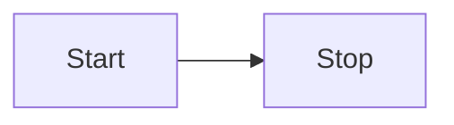
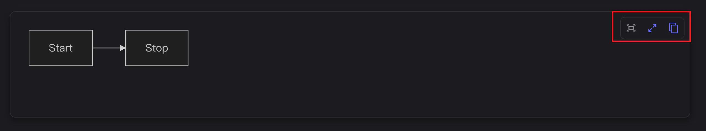

按照 [mermaid](https://mermaid.js.org/) 的语法要求来写即可。

输入：

````md

```mermaid
flowchart LR
  Start --> Stop
```
````

输出： 


```mermaid
flowchart LR
  Start --> Stop
```

会在鼠标悬停在图表上时，显示相关控制按钮：

 {w=1068px}
