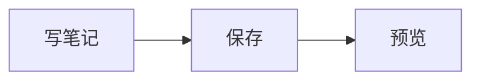

# Desk 扩展语法与组件

## 使用原则

以下内容分为 Markdown 扩展和 Vue 组件。Desk 可视化编辑时，选中扩展块后可使用对应工具或“编辑源码”；源码视图可以直接修改原始写法。发布效果以知识库站点预览为准。

## 提示和折叠容器

```md
::: tip 提示标题

这里可以写段落、列表和其他 Markdown。

:::

::: details 点击展开

这里是折叠内容。

:::
```

| 容器名 | 含义 | 无标题时站点显示 |
| --- | --- | --- |
| `info` | 信息 | `INFO` |
| `tip` | 提示 | `TIP` |
| `warning` | 警告 | `WARNING` |
| `danger` | 错误或危险提示 | `DANGER` |
| `details` | 可展开的细节 | `详情` |

`:::error` 是 Desk 快捷输入，会转换成 `::: danger`。直接写入文件的正式容器名是 `danger`，不是 `error`。同理，`:::code` 是编辑器快捷输入，不是发布站点的代码容器。

## 代码组

````md
::: code-group

```js [JavaScript]
const value = 1
```

```ts [TypeScript]
const value: number = 1
```

:::
````

每个代码围栏成为一个标签页，`[标题]` 决定标签名称。围栏可以继续使用行号、高亮行等元信息。切换标签会展开目标代码块。

## 图片轮播 Swiper

```md
::: swiper


:::
```

一张图片独占一个段落，alt 作为图片标签；空 alt 使用 `img`。轮播容器面向图片列表，不是任意 Vue 内容的轮播布局。附件路径需替换为真实图片。

## Mermaid

````md

````

`center` 可选，表示默认居中。工具区支持复制源码、居中切换和全屏查看。图内具体图表语法由内置 Mermaid 版本决定。

`mmd` 是 Desk 的输入别名；如果文件最终留下 `mmd` 围栏，SSG 会按 Mermaid 代码展示源码，不生成图。发布前应确认围栏名是 `mermaid`。

## Mindmap

````md
```mindmap [学习计划] 2
- Markdown
  - 段落
  - 链接
- Desk
  - 编辑
  - 预览
```
````

- 正式围栏名是 `mindmap`。
- `[学习计划]` 指定根标题，优先于内容里的 H1；两者都没有时使用 `root`。
- 数字表示初始展开层级，最小为 1；不指定时组件默认 3。
- 内容使用 Markdown 列表，也可包含根 H1、节点内链接、图片和行内格式。
- Desk 对已适配的脑图块提供编辑入口，修改会回写围栏；站点生成的脑图默认只读，提供脑图、大纲和源码视图。
- `mmp` 只是 Desk 输入别名，正式文件应保留 `mindmap`。

不支持旧教程中的 `<<<` 外部脑图文件引入。要在知识库笔记里展示脑图，应把内容放进笔记自身的围栏中。

## 足迹 Footprints

```md
::: footprints 2026-09-15 14:30

今天整理了 Desk 使用说明。

补充一段文字。


---

补充信息

:::
```

容器标题后写日期时间，正文为段落和图片，`---` 后为附加信息。容器接受 `YYYY-MM-DD`、`YYYY-MM-DD HH:mm` 或 `YYYY-MM-DD HH:mm:ss`，**不能只写 `YYYY-MM`**；直接组件的 `times` 数组是另一套输入，不要混用。

它是个人动态展示块，不是任意 Markdown 复杂布局的容器。组件根据内置生日基准显示足迹天数，目前没有库级生日配置。默认发布站点只保留其服务端渲染内容，未接回该组件的展开、弹窗等 Vue 点击处理；历史截图中的交互不代表当前站点已实现。

## BilibiliVideo

```md
<BilibiliVideo id="BV1QR4y1y7GG" :autoplay="false" :muted="false" />
```

| 属性 | 类型 / 默认 | 用途 |
| --- | --- | --- |
| `id` | 字符串，必填 | BVID |
| `autoplay` | 布尔值，默认 `false` | 请求自动播放；最终受浏览器和播放器策略影响 |
| `muted` | 布尔值，默认 `false` | 请求静音 |

使用正式组件名和 `id`，不要把历史片段里的 `<BVideo bvid="..." />` 当成内置别名。

## WordList

```md
<WordList :words="['cancel', 'salary']" :needSort="true" />
```

| 属性 | 默认 | 用途 |
| --- | --- | --- |
| `words` | `[]` | 单词字符串数组 |
| `needSort` | `false` | 按字母排序 |
| `wordsBaseUrl` | `https://github.com/tnotesjs/en-words/blob/main/` | 单词源页面地址前缀 |
| `wordsRawBaseUrl` | `https://raw.githubusercontent.com/tnotesjs/en-words/refs/heads/main/` | 获取单词内容的地址前缀 |
| `features` | 四个功能开关默认均为 `true` | 见下表 |

`features` 支持 `enableCards`（释义卡片）、`enableWordData`（获取词条）、`enableContextMenuPin`（钉住卡片菜单）、`enableContextMenuAutoShowCard`（自动展示卡片菜单）。上表默认值是组件自身默认值，不是 Desk/SSG 的实际启用状态：

- Desk 块预览显式关闭以上四项。
- 默认 SSG 渲染单词列表与链接，但不挂载 WordList 的悬浮卡片、发音、自定义右键菜单和持久化事件。
- Desk 的结构化 WordList 编辑器只读写 `words` 和 `needSort`。若手写了 `wordsBaseUrl`、`wordsRawBaseUrl` 或 `features`，再经结构化面板修改可能丢失这些额外属性；此时应保持源码编辑并检查差异。

## NotesTable

```md
<NotesTable :ids="['0043', '0044', '0049']" />
```

`ids` 必须是**当前库的四位笔记编号字符串**，不要填 UUID 或完整文件名。表格读取笔记标题与 frontmatter `description`，生成笔记链接；缺失编号会给出提示。编号的排列顺序决定表格顺序。

## Excalidraw 自由绘图

在 Desk 中通过 `/ex` 创建画布，之后使用画布编辑入口修改。保存结构为：

```text
assets/0045-名称.excalidraw    # 可再次编辑的数据
assets/0045-名称.svg          # 同名展示文件
```

```md

```

发布站点直接展示图片。当前没有通过 `<Excalidraw />` 自动加载画布的内置组件语法，也不要删除 `.excalidraw` 后只留 SVG。

## 其他已注册组件

以下补充项与前文的 BilibiliVideo、WordList、NotesTable 合计为站点注册的 12 个组件。它们不一定具有独立的 Desk 斜杠菜单或可视化属性面板。

**注册、服务端渲染和浏览器交互是三个不同层次。** 默认 SSG 正文是静态 HTML，仅对代码、轮播、标准 Mermaid/Mindmap 围栏等指定块补回交互。直接写 `<Mermaid>` / `<Mindmap>` 不会自动得到围栏生成的交互挂载标记；建议始终使用标准围栏。Bilibili iframe、普通链接可依赖浏览器自身工作，不代表其他 Vue 组件的点击事件也已接通。

| 组件 | 可用输入 | 说明 |
| --- | --- | --- |
| `Badge` | `text` 默认空、`type` 默认 `info`，可用 `info/tip/warning/danger`；也可写默认插槽 | 行内徽标，例如 `<Badge text="试用" type="tip" />` |
| `SidebarCard` | 可不传属性；`pending` 当前没有显示行为 | 展示当前站点目录中前 12 个笔记链接 |
| `ImagePreview` | `selector` 默认 `.tn-prose img, .vp-doc img` | 图片预览行为，通常由站点负责；不是图片资源本身 |
| `CodeBlock` | 必填 `code`；`info` 默认空；`lineNumbers` 默认 `true`；可选 `title`、`highlightedHtml` | 普通作者优先用代码围栏，避免手写高亮 HTML |
| `CodeGroup` | 必填 `items` 数组，项支持 `code/info/highlightedHtml/key`；也有默认插槽 | 普通作者优先用 `::: code-group` |
| `Mermaid` | `source` 为原始源码，`graph` 为编码源码；其余属性见下文 | 优先用 `mermaid` 围栏 |
| `Mindmap` | `source` 为原始 Markdown，`content` 为编码内容；其余属性见下文 | 优先用 `mindmap` 围栏 |
| `Footprints` | `times` 数字数组、`paragraphs` 字符串数组、`images` 字符串数组默认均为空；`otherInfo` 默认空 | 另有 `text-area/image-list/other-info` 插槽；优先用容器 |
| `Discussions` | 无作者配置属性 | 当前只显示前往 GitHub Discussions 的占位文字，不是已接入的 giscus 评论表单 |

直接使用 `Mermaid` 时，`source/graph/id` 默认空，`center` 默认 `false`，`isDark` 默认自动判断，`securityLevel` 默认 `loose`，`enableCopy/enableFullscreen/enableCenterToggle` 默认 `true`。

直接使用 `Mindmap` 时，`source/content` 默认空，`initialExpandLevel` 默认 3，`editable/expandLevelControl` 默认 `false`，`isDark` 自动判断；`resolveImageSrc/writeAsset` 是宿主接入资源读写的回调，不是 JSON 配置项。仅在站点标签上开启 `editable` 不会自动把网页修改保存回本地知识库。

## 自定义 Vue 组件

```md
<script setup>
import LocalMessage from '../assets/LocalMessage.vue'
</script>

<LocalMessage text="你好" />
```

先创建实际 `.vue` 文件。SSG 支持脚本和样式块及组件导入，组件内部插值可参与服务端渲染；**不会自动恢复自定义组件在浏览器中的事件和响应式更新**。需要客户端交互时必须额外实现宿主接入，单纯导入组件不够。

Desk 可视化编辑不会执行所有任意自定义组件，遇到不支持的内容使用源码与站点预览。正文 `{{ }}` 按字面保留，组件内部插值也不等于整篇正文是可交互 Vue 页面。
